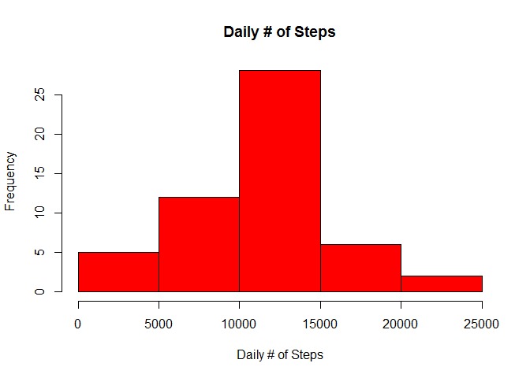
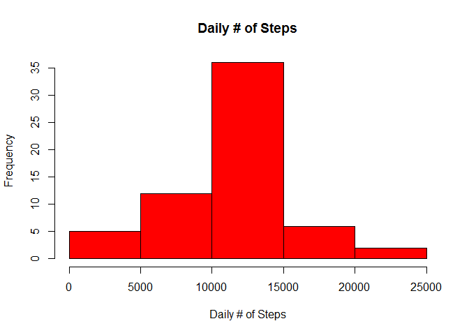
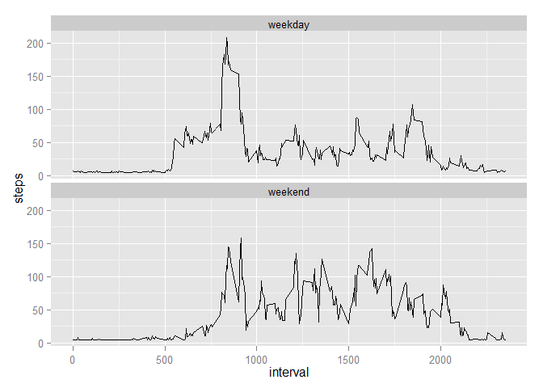

# Reproducible Research: Peer Assessment 1
## Loading and preprocessing the data
1. First I will load the ggplot2 library.  I will unzip the data file, then read it. The only preprocessing I see is setting the date column in the date format. 

```r
library(ggplot2)
```

```
## Warning: package 'ggplot2' was built under R version 3.1.2
```

```r
unzip("activity.zip")
data <- read.csv("activity.csv")
```
2. The only preprocessing I see is setting the date column in the date format. 

```r
data$date <- as.Date(data$date)
```

## What is mean total number of steps taken per day?
1. To ignore the NA cases.

```r
data.completecases <- na.omit(data)
```

2. Calculate the total steps per day, for each day.

```r
stepsperday <- with(data.completecases, tapply(steps, date, sum))
```

3. Plot histogram of the total number of steps taken each day.

```r
hist(stepsperday, col = "red", main = "Daily # of Steps", xlab = "Daily # of Steps")
```

 

4. Calculate the mean & median steps per day.

```r
mean1 <- mean(stepsperday)
mean1 <- as.integer(mean1)
median1 <- median(stepsperday)
```
The mean number of steps per day is 10766. The median number of steps per day is 10765. 

## What is the average daily activity pattern?
1. Make a time series plot of the 5-minute interval (x-axis) and the average number of steps taken, averaged across all days (y-axis)

```r
stepsminute <- aggregate(steps ~ interval, data=data.completecases, FUN=mean)
ggplot(stepsminute, aes(x=interval, y=steps)) + geom_line(stat="identity")
```

 

2. Which 5-minute interval, on average across all the days in the dataset, contains the maximum number of steps?

```r
stepsmax <- stepsminute$interval[which.max(stepsminute$steps)]
```

The 5-minute interval with the average maximum number of steps is 835. 

## Imputing missing values
1. Calculate the number of missing values in the dataset.  

```r
numbermissing <- sum(is.na(data$steps))
```

The number of missing values is 2304. 

2. In order to fill in the missing values, I will fill with the average number of steps overall. I will create a new dataset to contain the imputed numbers. 

```r
fillData <- data
fillData$steps[is.na(fillData$steps)] <- mean(na.omit(data$steps))
```
3. Make a histogram of the total number of steps taken each day.

```r
stepsperday2 <- with(fillData, tapply(steps, date, sum))
hist(stepsperday2, col = "red", main = "Daily # of Steps", xlab = "Daily # of Steps")
```

 

4. Calculate and report the **mean** and **median** total number of steps taken per day. 

```r
mean2 <- mean(stepsperday2)
mean2 <- as.integer(mean2)
median2 <- median(stepsperday2)
median2 <- as.integer(median2)
```
The mean number of steps per day is 10766. The median number of steps per day is 10766. The mean stayed the same while the median went up one. 

## Are there differences in activity patterns between weekdays and weekends?
1. Create a new factor variable in the dataset with two levels -- "weekday" and "weekend" indicating whether a given date is a weekday or weekend day.

```r
fillData$day[weekdays(as.Date(fillData$date)) %in% c("Saturday", "Sunday")] <- "weekend"
fillData$day[!weekdays(as.Date(fillData$date)) %in% c("Saturday", "Sunday")] <- "weekday"
fillData[, 4] <- as.factor(fillData[, 4])
```
2. Make a panel plot containing a time series plot (i.e. `type = "l"`) of the 5-minute interval (x-axis) and the average number of steps taken, averaged across all weekday days or weekend days (y-axis).

```r
stepsweekend <- aggregate(steps ~ interval + day, data=fillData, FUN=mean)
ggplot(stepsweekend, aes(x=interval, y=steps, group=1)) + geom_line() +
    facet_wrap(~ day, ncol=1)
```

 

Finished!
